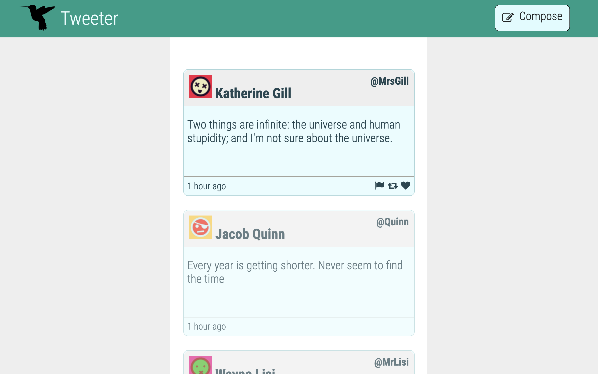
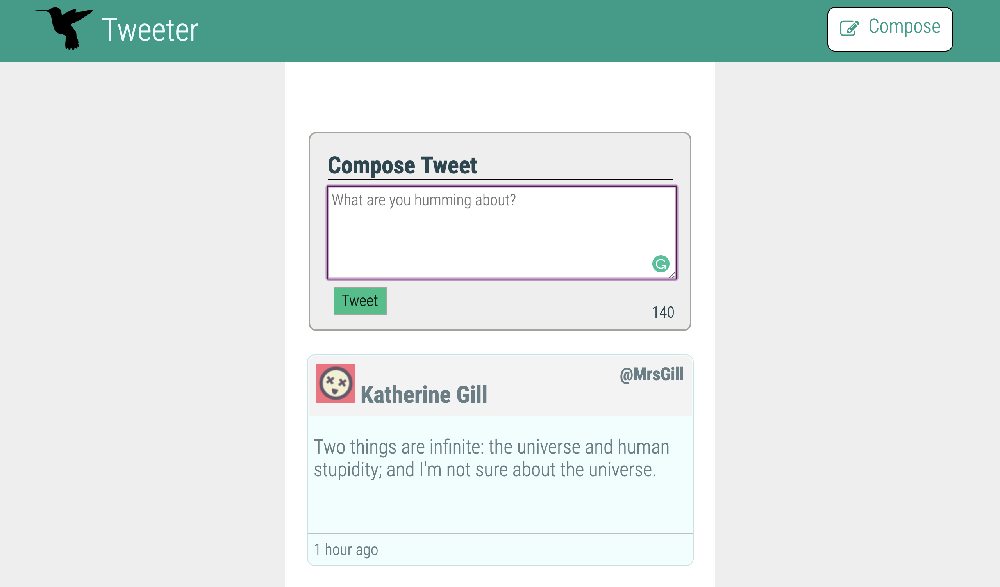
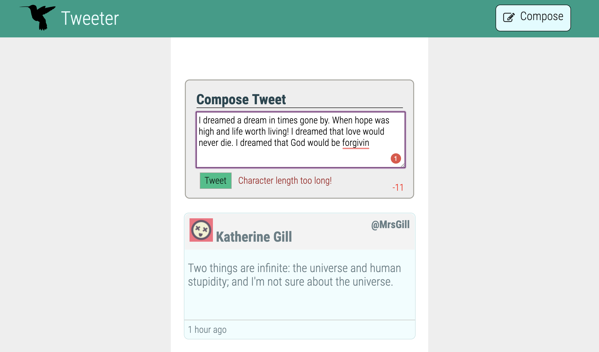

# Tweeter

Tweeter is a single webpage clone of Twitter

In this project I practised HTML, CSS, JS, jQuery and AJAX front-end skills. This was also the first time in using MongoDB. Node and Express were used to set up the server.

## Getting Started

1. Install the following dependencies using the `npm install` command.
2. Start the web server using the `npm run local` command. The app will be served at <http://localhost:8080/>.
3. Go to <http://localhost:8080/> in your browser.

## Dependencies

- Express 4.13.4 
- Node 5.10
- Body-parser 1.15
- Bootstrap 4.3.1
- Chance 1.0.2
- md5 2.1.0
- Mongodb 2.2.36

## Screenshots

- Here is the web page when loaded

- Here is the page when compose button is clicked

- Here is a example of a error displayed when the tweet length is too long.
